# stisla

## Login

1. Login Requires All Fields\s
   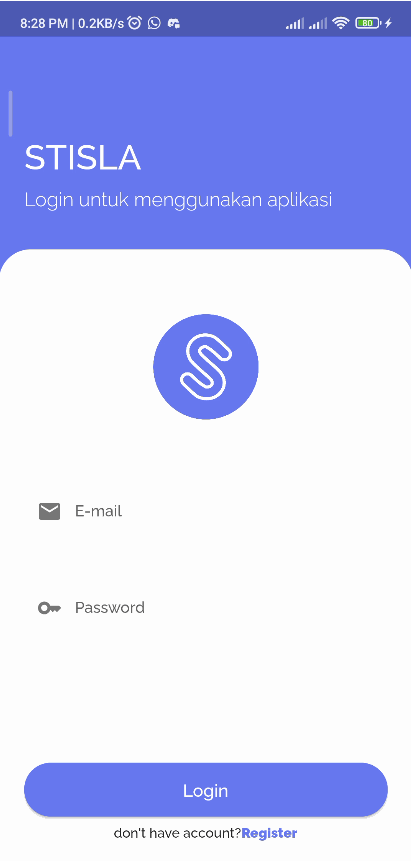
2. Login Require Email Field\s
   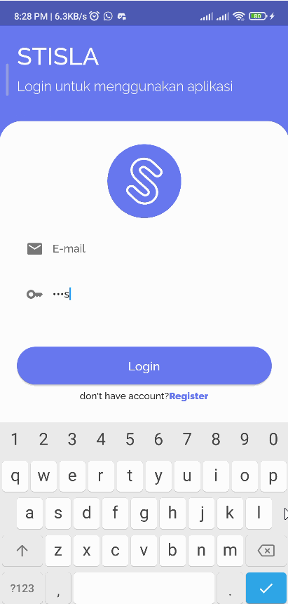
3. Login Require Password Field\s
   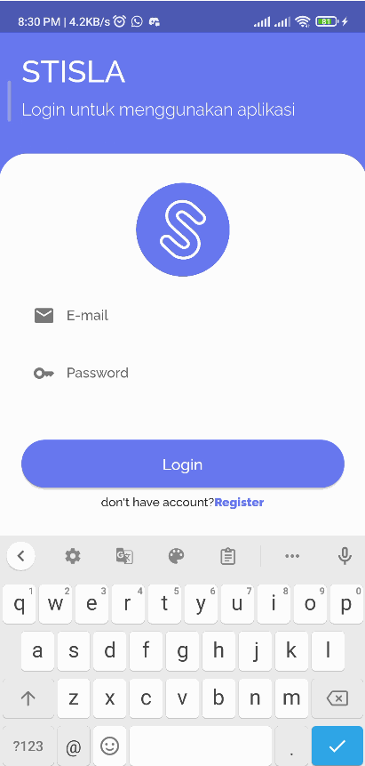
4. Login Require Correct Email Type\s
   
5. Login With Wrong Credentials\s
   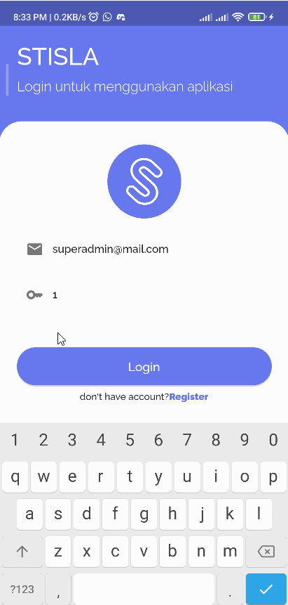
6. Login Success\s
   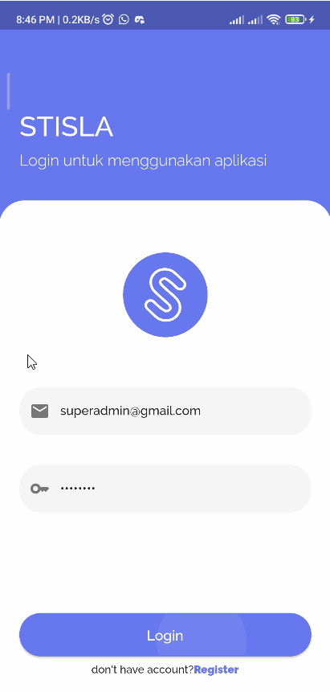
7. User Already Login And Open The Application\s
   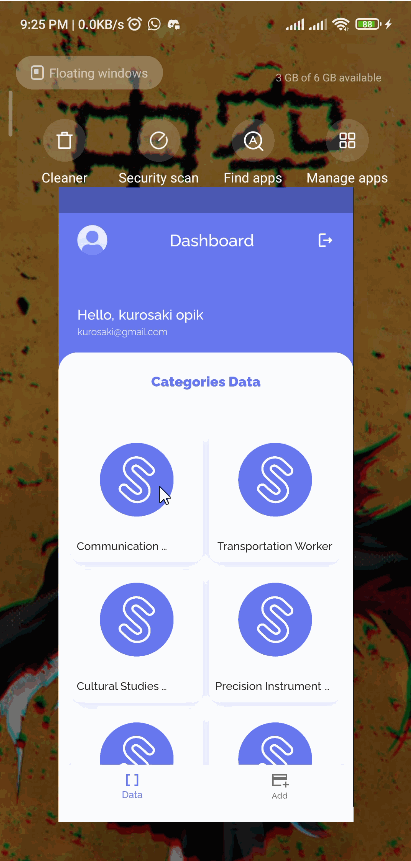

## Register

1. Register Requires All Fields\s
   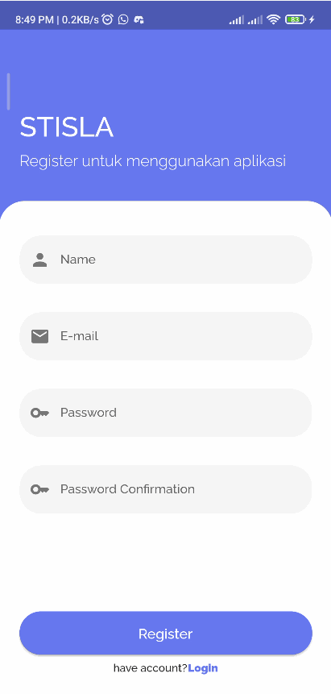
2. Register Requires Email And Password\s
   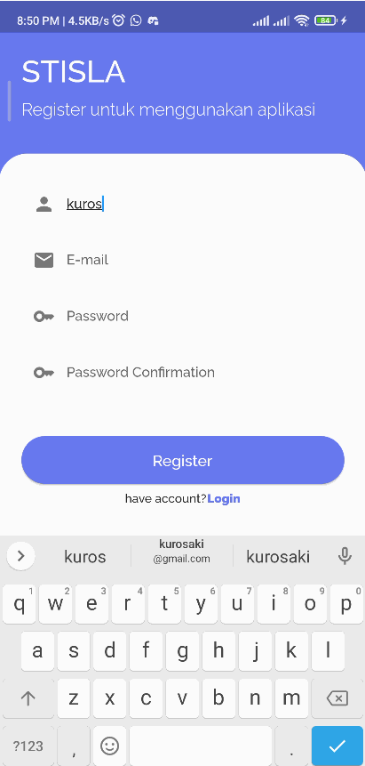
3. Register Require Password Field\s
   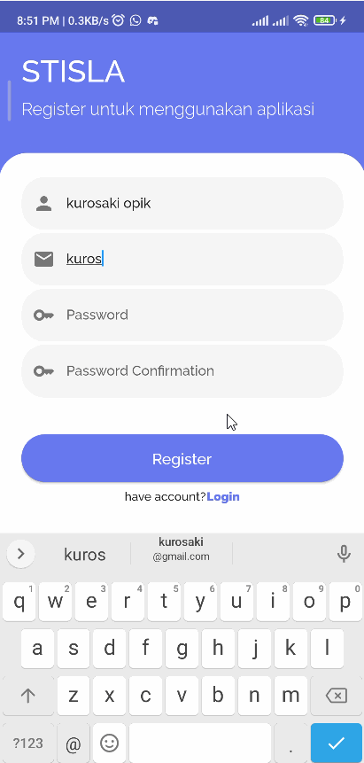
4. Register With Wrong Password Confirmation\s
   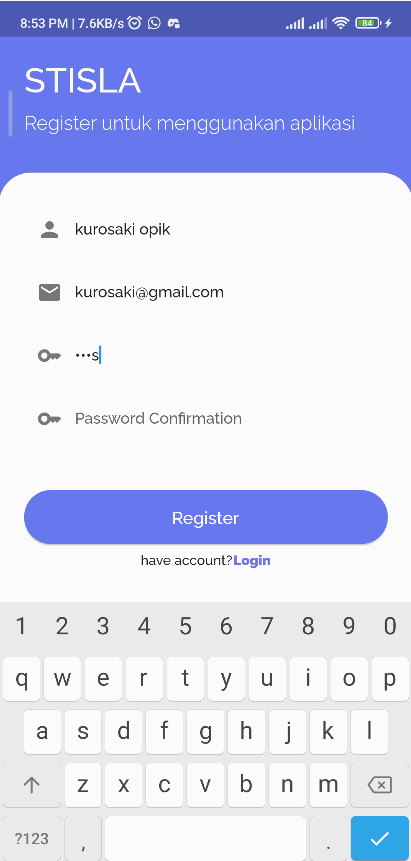
5. Register With Password Less Than 8 Characters\s
   
6. Register Success And Auto Login\s
   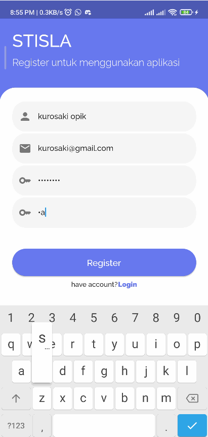

## Create

1. Create Category With Null Value\s
   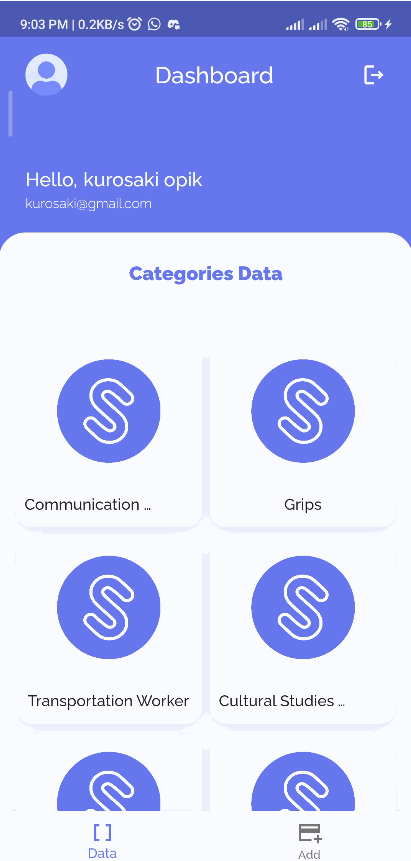
2. Create Category With Same Value In The Database\s
   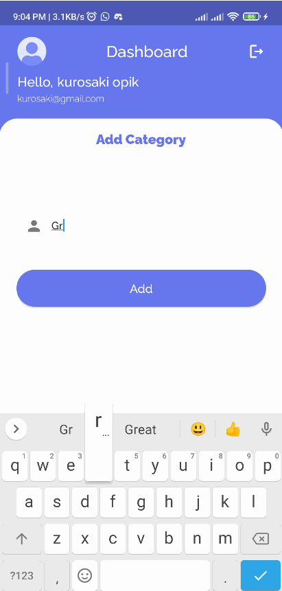
3. Create Category Success\s
   

## Read

- Read Categories data with pagination using infinite scroll concept\s
  

## Update

1. Update Category With Null Value\s
   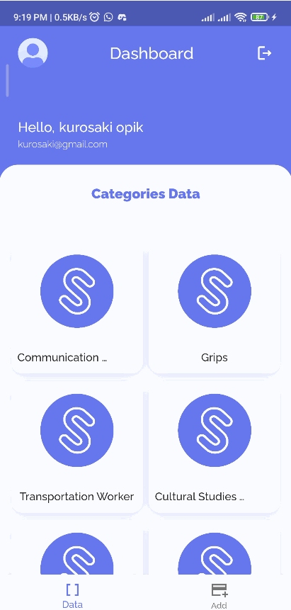
2. Update Category Success\s
   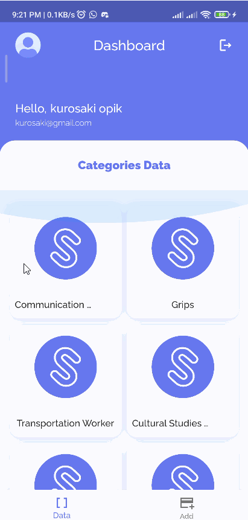

## Delete

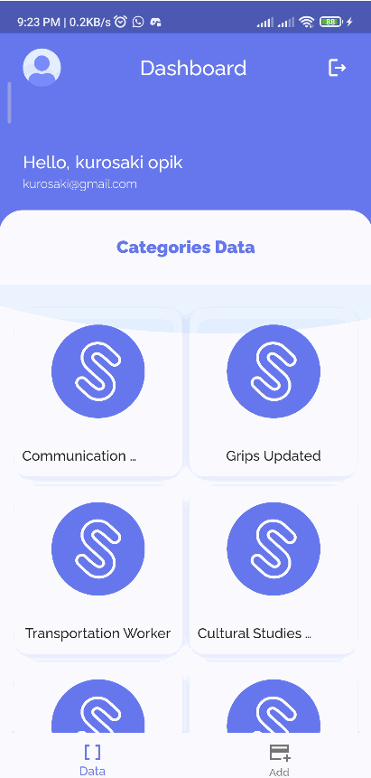
